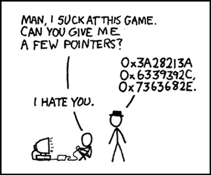
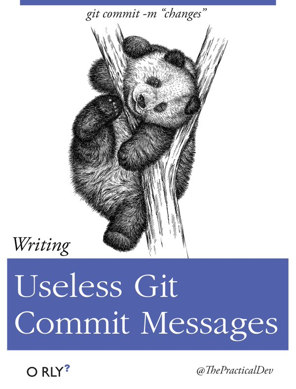
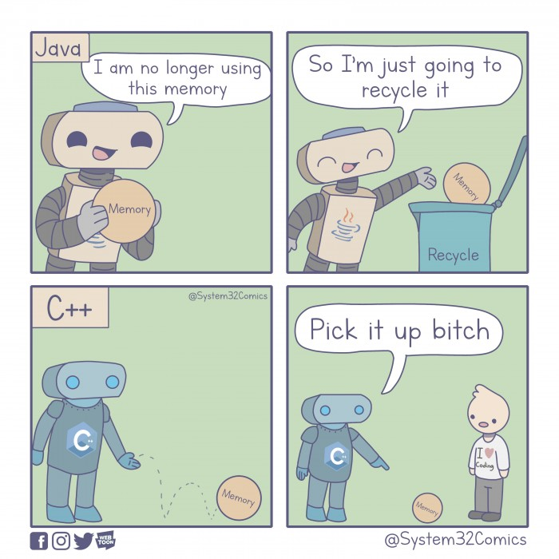
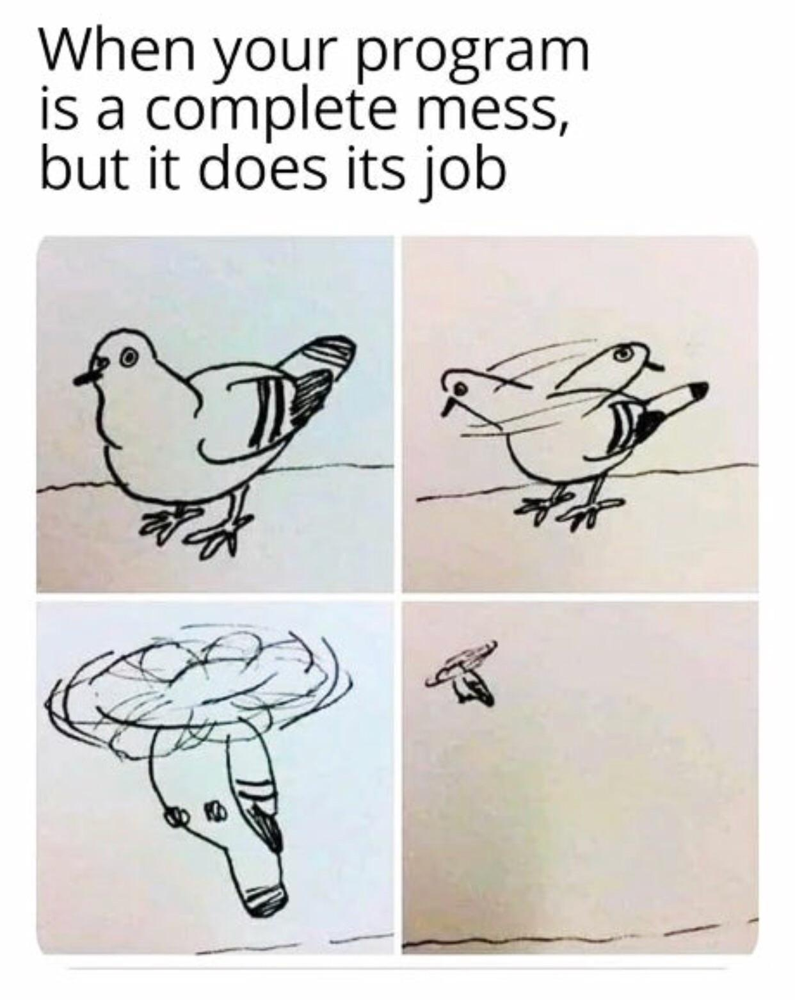

# Dev Joke

#### Send me a PR if you know a good Dev Joke.

Thank you for adding a DevJoke. At text jokes at the **TOP** of the page, add your joke followed by `***`. Add images at the **BOTTOM** with a reference to the image in the README file.

***
Question - What is the most used language in programming?

Profanity.


***
Question: Why don't keyboards sleep?
Answer: Because they have two shifts.


* * *


Q: Which famous rapper knows Assembly?

A: JZ.

* * *

Q: Why do programmers keep pressing the F5 button?

A: Because it’s refreshing.

* * *

Q: What do you call a computer that sings?

A: A dell.

***

Q: Why are assembly programmers always soaking wet?

A: Because they work below C level.

* * * 

Q:Tell Something About You.(To A Programmer)

A:I'm a writer, but no one in my relatives can read what i write.


* * *

Q: Why do programmers prefer dark mode?

A: Because light attracts bugs

***

Q: Favourite actor of a JavaScript Developer is?

A: JSON Statham 

* * *

Q: Why do they call it hyper text?

A: Too much JAVA.

***


Q: Who won the debate for the best name for loop variable?

A: i won.


* * *

Q: How did the Coder CEO build his company headquarters?

A: By calling the Constructor();

* * *

Q: What is Hardware?

A: The part of the computer which you can kick.

* * *

Q: Who is a programmer?

A: A programmer is a machine who turns coffee into code.


* * *
Question: Why NodeJs developer need Helmet?

Answer: To Secure Headers.

* * *
Question: What do programmers inherit?

Technical Debt


* * *

Doom file size 1993 2.39Mb, look how much hard drive space we saved you.
JPEG image file size 2021 6.23MB, mobile first???
CALL OF DUTY UPDATE 2021 133.6GB, let them buy an external harddrive!

* * *

And the bartender says, "Success, but you're not ready!"

So a JavaScript function walks into a bar.

* * *

I took a programming class in high school
I got a C++

* * *
First rule of programming : If it works DON'T touch it.

* * *
Married life of a developer

```
#wife {
    right: 100%;
    margin: 0;
}
```
* * *

I would tell you a joke about programming...

But it only works on my machine

* * *
What is the problem with git jokes?

Everyone has their own version!

* * *

I have a joke about stackoverflow but you will say it's duplicated

***


***


There are two types of People{

and those who
{
Question: How do you know if someone uses Linux?

Answer: Don't worry, they'll tell you.

* * *

Best pickup line for a JS dev ?

- Be the promise to my callback ❤️.


***
- A QA engineer walks into a bar.
  Orders a beer. Orders 0 beers.
  Orders 99999999999 beers.
  Orders a Iizard. Orders -1 beers.
  Orders a ueicbksjdhd.

- First real customer walks in
  and asks where the bathroom
  is. The bar bursts into flames,
  killing everyone.

***

New programmer : It realy worked at first time.👍

Experienced programmer : It realy worked at first time??🤔

***
📄 Documentation is like sex.

When it's good, it's very good.
When it's bad, it's better than nothing. 🤷

***

99 year old man dying

man: Oh! God, Save Me!!

God: Ok, JPG or JPEG?

***
"Only my friends get to touch my private parts."
-C++

* * *

Wife: Honey! Can't open the jar.

*Me: Download and install Java.

* * *

Sometimes when I'm writing **Javascript** I want to throw up my hands and say "this is bullshit!" but I can never remember what **"this"** refers to

* * *
Why do programmers have bad digestion?

They only have semi-colons
* * *

1st rule of programming:

**If it works, do not touch it!**
* * *

Me: Why isn't this working? 🤔
Normal Language: You screwed up over here. 🧐
Me: Oh Thanks! 👍

Me: Why isn't this working? 🤔
JavaScript: SHHHHHH! 🤫

* * *

Data scientists should be charged with animal trafficking and animal abuse because they import pandas and feed them to python.


* * *

* * *


A logician's wife is having a baby.
The doctor immediately hands the newborn to the dad.
The wife asks impatiently "Is it a boy or a girl?"
The logician replies "Yes."

* * *

The programmer to his son: "Here, I brought you a new basketball."
"Thank you, daddy, but where is the user's guide?"😜

* * *
Once all programming languages went to a party.
Guess who paid the bill?
Of course, PHP.
Beacause PHP has many $.

* * *
A fool can write a code that a computer can understand.
Good programmers write code that they also don't understand after few days.

* * *
I've been using VIM since about 5 years because I never find out how to quit.

* * *

If an EXE file says:
"This program requires Windows XP or better..."
Does that mean that it'll run linux..? :)

* * *
To replace programmers with robots, clients will have to accurately describe what they want.

We are safe! 😏

* * *
A guy ordered a pizza with cheese, olives, onion and red pepper. On getting it, the guy shouted - It is not baked.

Delivery guy - You only get what you ask for.
* * *

If somebody refers me for a job 👨‍💻 will it be considered 'pass by reference' or 'pass by value'? 🤔😂

* * *

Once C++ walks into a bar and sees C.

C is drunk, falling on the floor, spitting and swearing.

How classless! -says C++

* * *

Are you a RESTful API? because you GET my attention, PUT some love, POST the cutest smile, and DELETE my bad day

***

I used to know a joke about Java, but I run out of memory.

***

Why do Front-End Developers eat lunch alone?

Because, they don't know how to join tables.

* * *

I am declaring a war.
var war;

* * *

Knock knock

Unsynchronized block

Who's there?

* * *

“Knock, knock.”

“Who’s there?”

very... long... pause...

“Java.”

* * *

There are 10 types of people in the world: those who understand binary, and those who don’t.

* * *

walks UDP package into bar A.

* * *

I would tell you a joke about UDP, but I don't know if you will get it.

Either way, I don't care.

* * *

A SQL query goes into a bar, walks up to two tables and asks, "Can I join you?"

* * *

A programmer puts two glasses on his bedside table before going to sleep. A full one, in case he gets thirsty, and an empty one, in case he doesn’t.

* * *

Knock knock.

Whos there?

Broken state machine.

Broken state machine who?

Knock knock.


* * *

    #pisa-tower {
      font-style: italic;
    }

* * *

Two bytes meet.  The first byte asks, “Are you ill?”
The second byte replies, “No, just feeling a bit off.”

* * *

1/3 of US bandwidth is used by Netflix.

the rest is used by `rm -rf node_modules && npm install`

* * *

Debugging: Being the detective in a crime movie where you are also the murderer.

* * *

Behind every good program is a frustrated programmer.

* * *

Being a Programmer and watching someone HACK a computer on a TV show is like a nurse and watching someone in the movie take blood with a carrot.

* * *

Programmer 1: We have a problem!
Programmer 2: Let’s use RegEx!
Programmer 1: Now we have two problems.

* * *

My girlfriend dumped me after I named a class after her. She felt I treated her like an object.

* * *

Trying to fix the problem I created when I tried to fix the problems I created when I tried to fix the problems I created when there was a problem

* * *

A programmer’s wife asks: “Would you go to the shop and pick up a loaf of bread? And if they have eggs, get a dozen.”

The programmer returns home with 12 loaves of bread.

“They had eggs.”

* * *

Q: What do you call a programmer from Finland?

A: Nerdic

* * *

Question - How did the developer announce her engagement?

`this.engaged = true`

* * *

Question - Why is the Javascript developer sad?

Because they do not Node how to Express themselves.

* * *

Question - How do you comfort a JavaScript bug?

You console it.

* * *

Question - Why couldn't the React component understand the joke?

It didn't get the context.

* * *

Question - Why did the JavaScript developer leave?

Because she didn't get arrays

* * *

Question - What is the object-oriented way to become wealthy?

Inheritance.

* * *

 Question - Why do functions always break up?

Because they have constant arguments.

* * *

Question - Why do programmers get confused between Halloween and Christmas?

Because OCT 31 = DEC 25

* * *

Question - What is programmer's favourite hangout place?

Foo Bar

* * *

Question - What kind of doctors fixes broken websites?

A URLogist

* * *

Question - Why does no one likes SQLrillex?

He keeps dropping the database

* * *

Question - How did html get drunk?

It had too many <br/>

* * *

Question: Why do C# and Java developers keep breaking their keyboards ?

Because they use a strongly typed language.

* * *

Question - Why did the developer die in the shower?

He read the shampoo bottle instructions: Lather. Rinse. Repeat.

* * *

Question - Why do fish not like React?

Because it has Hooks 😂.

* * *

Question - How long does a loop last?

For a while

* * *

Question - What did the developer said to the repository?

FORK YOU!

* * *

Question: What do you call the security outside of a samsung store?

Guardians of the Galaxy

* * *

Question: Why does Python live on land?

Because it's above C-level

* * *

Question - How are computers and air conditioners similar?

They are both useless when you open windows

* * *

Question - Who is a programmer?

Answer: A person who fixed a problem that you don't know you have, in a way you don't understand.

* * *

Question - Why do Java developers wear glasses?

Answer: Because they can't C# !

* * *

Question - How do functions break up?

Answer: They stop calling each other.

* * *

Question - 0 is false and 1 is true, right?

Answer: 1

* * *

Question: How many programmers does it take to change a light bulb?

Answer: None – It’s a hardware problem

* * *

Question - Why do software engineers consistently stir up Halloween and Christmas?

Answer: Because  Oct 31 = Dec 25

* * *

Question - Have you heard of the band with 1023 megabytes?

No, they just haven't had a gig yet.

***
Question - What screams "I'm insecure"?

Http

***

Question - Why dod the software developer go broke?

They used up all their cache.

***

Question - Why did the react class component feel relieved?

Because it was now off the hook.

***

Question - Why did the child component have such great self-esteem?

Because its parent kept giving it props!

***

Question - Which type of shooting always hurt the shooter?

Trouble-shooting!


***
Question- What's the object oriented way to become wealthy?
Answer  - Inheritance.

***

Conversation between layman and developer

-   layman: Hey! What's your address
-   developer: 173.168.15.10
-   layman: No man. Your local address
-   developer: 127.0.0.1
-   layman: I mean your physical address
-   developer: 29.01.38.62.31.58

***

:boy: : I like you, do you want to be my GF?

:girl: : ... (30 seconds)

:boy: : Why are you quiet?

:girl: : ... (30 seconds). "504 Gateway Timeout"

***

#### Pointers in C:

"I know a guy who knows a guy... who knows another guy"

* * *

Two strings walk into a bar and sit down. The bartender says, “So what’ll it be?”

The first string says, “I think I’ll have a beer quag fulk boorg jdk^CjfdLk jk3s d#f67howe%^U r89nvy\~~owmc63^Dz x.xvcu”

“Please excuse my friend,” the second string says, “He isn’t null-terminated.”

* * *

What do the new MacBook and a black hole have in common?

There's no Escape!

* * *

One man's constant is another man's variable

* * *

Android: where ProgressBars go around in circles and Spinners don’t spin

* * *

I showed my 12 year son aa floppy disk....
He said "ohh nice!! You have 3-D printed the save icon."

* * *

All programmers are playwrights, and all computers are lousy actors

* * *

"Don't call me, I'll callback you. I promise!"

* * *

"How did your dog eat your coding assignment?"
It took him a couple bytes

* * *

I would love to change the world, but they won’t give me the source code.

* * *

Python and PHP.

One of these two is one of the most popular choices of backend programming. The other one is PHP.

* * *

Dad: So what do you want to do when you grow up?

Kid: Engineering

Dad: Oh great, so you want to become an engineer?

Kid: No, I want 4 more years to decide what I want to do

* * *

A successful programmer is a PRO in GRAMMAR!

* * *

A journalist asked a programmer:-what makes code bad?

Programmer:- No comment

* * *

Chuck Norris doesn’t bug hunt, he goes bug killing.

* * *

why do Elm developers type so loudly?

cause it's a strongly typed language.

* * *

Chuck Norris don’t need passwords to access your system, he simply types \* and system gives him access.

* * *

Ford is creating a line of electric cars that use Tesla parts and software. They're calling it Edison.

* * *

I see this person every day who is huge by the way and yet everybody ignores that person.
Do you wanna know who?

node underscore modules

Wrong middle name anyways!

* * *

{
 "devjoke":"people with name Jason might have felt invalid once JSON came into picture"
}

* * *

I have a dev joke, but I couldn't debug it 😭

* * *


Forgetting the semicolon after every C command and getting an error makes me go ;_;

* * *
any one know any joke about sodium??
NA

***

There are three kinds of lies: Lies, damned lies, and benchmarks.

***

- How do you tell HTML from HTML5?
- Try it out in Internet Exlorer.
- Did it work?
- No?
- It's HTML5.


* * *

I went on a date. The girl said " Pass the salt ". I replied " Pass by value or by reference!"

* * *


A journalist asked a programmer:-what makes code bad?
Programmer:- No comment

***



A physicist, an engineer and a programmer were in a car driving over a steep alpine pass when the brakes failed. The car was getting faster and faster, they were struggling to get round the corners and once or twice only the feeble crash barrier saved them from crashing down the side of the mountain. They were sure they were all going to die, when suddenly they spotted an escape lane. They pulled into the escape lane, and came safely to a halt.

The physicist said "We need to model the friction in the brake pads and the resultant temperature rise, see if we can work out why they failed".

The engineer said "I think I've got a few spanners in the back. I'll take a look and see if I can work out what's wrong".

The programmer said "Why don't we get going again and see if it's reproducible?"

***

I now understand why english grammar was taught in school,because it takes me a while to think the difference between "sign up" and "sign in" before i click the wrong one.
***


I keep trying to understand angular.

But its just so obtuse

***

Guy 1: Its so cold, the heater has stopped working !!
Android Dev: (Turns on Android Studio) There you go !
***


Son: Dad, why do the sun rise in east and set in west ?
Programmer dad: hey, it works!! Don't touch it ;

***


A programmer walks to the butcher shop and buys a kilo of meat.  An hour later he comes back upset that the butcher shortchanged him by 24 grams.


***

The best thing about a Boolean is even if you are wrong, you are only off by a bit.

***

#### Question: What's did the Git engineer ask the waitress for?

Answer: A fork.

***

#### Q. In a world where computer programs were TV shows, why would a JS program never be a reality TV show?
Ans. - because it's scripted.

***

#mother {
  right: 100%;
  margin: 0;
}

***

She: You told me you were fullstack!
Me: Full Stackoverflow
***

Question: What is a computer's favorite beat?
Answer: An algo-rhythm


***

Friend: you both look like a cute couple!! where did you find her? tinder or insta?
Me: GITHUB

***


A user interface is like a joke.
If you have to explain it,It's not that good 😃 😀 😄

* * *


Android: where ProgressBars go around in circles and Spinners don’t spin

***

What did the Python say when he came out of his shell?
Print("Hello World!")

***

I showed my 12 year son aa floppy disk....
He said "ohh nice!! You have 3-D printed the save icon."

***

All programmers are playwrights, and all computers are lousy actors

***

Algorithm :

Words used by a programmer when they don't want to explain what they did.

***

I had a problem earlier, then I started using Java.
Now I've a ProblemFactory.

***

Me during my AI Presentation:
I have some good markov jokes, but really if you've heard one you've heard them all.

***

Eight bytes walk into a bar.  The bartender asks, “Can I get you anything?”
“Yeah,” reply the bytes.  “Make us a double.”

***


Programmer: Son, can you count to 10?
3 yr old son: 1...2...
Programmer: Stop. You are not my son,

***
The Profession is Programming. But, all they do is create New Objects.
***

To understand what recursion is, you must first understand recursion.

***

Non-Programmer - You can't keep doing the same thing and expect different results🧐

Programmer- Let me introduce you to "DEBUGGING"💻⚠

***

#### What is a ghost's favourite type?

Answer: Boooooooolean.

***

### I'd like to make the world a better place...

But they won't give me the source code.

***


***


* * *


* * *


* * *


* * *


* * *


* * *


* * *


* * *


* * *


* * *


* * *


* * *


* * *


* * *


* * *


* * *


* * *


* * *


* * *


* * *


* * *


* * *


* * *


* * *


* * *


* * *


* * *


* * *


* * *


* * *


* * *


* * *


* * *


* * *


* * *


(.images/webjava.jpg)

* * *



* * *


* * *


* * *


* * *


* * *


***


* * *


* * *


* * *


* * *


* * *


* * *


* * *


* * *


* * *


* * *


* * *


***
### Question - Why integration testing is required after unit testing?

Answer: 

***


***


* * *


* * *


* * *


* * *


* * *


***


***


***


***


Son: Dad, why do the sun rise in east and set in west ?
Programmer dad: hey, it works!! Don't touch it ;

***


A programmer walks to the butcher shop and buys a kilo of meat.  An hour later he comes back upset that the butcher shortchanged him by 24 grams.

***

The best thing about a Boolean is even if you are wrong, you are only off by a bit.

***

#### Question: What's did the Git engineer ask the waitress for?

Answer: A fork.

***

#### Q. In a world where computer programs were TV shows, why would a JS program never be a reality TV show?
Ans. - because it's scripted.

***

#mother {
  right: 100%;
  margin: 0;
}

***

She: You told me you were fullstack!
Me: Full Stackoverflow
***


***

#### What is a computer's favorite beat?
Answer: An algo-rhythm

***

### If Programming Languages Were To Propose:

Java: I promise there hasn’t been a day that I stopped wanting you and haven’t gotten out of my head at all since I first met you!!

Python: I love you ;)

***

Ubuntu users are apt to get this joke

***

#### What do you call a programmer from Finland? 
Answer: Nerdic
***

An Algorithm a day, Keeps a mass recruiter away.


***


***

What did the router say to the doctor?
“It hurts when IP”

***


***


***
To replace programmers with robots, clients will have to accurately describe what they want.
We are safe.

***

I love pressing the F5 key. It's refreshing.

***

Chuck Norris’s keyboard doesn’t have a Ctrl key because nothing controls Chuck Norris.

***

#### Question: Why do programmers and coders hate nature?

Answer: It has too many bugs.

***

#### What would you call a web developer who enjoys finding bugs?
Answer: spider

***

#### Why is shipping code a lie?

Answer: Because every deploy has "ploy" in it.

***

Autocorrect can go straight to he’ll. —Constance Normandeau

***


#### What did the Java code say to the C code?

Answer: You've got no class.

***

Did you hear about the monkeys who shared an Amazon account? They were Prime mates.

***


Due to Coronovirus (COVID19) all TCP applications are being converted to UDP to avoid Handshakes..!!

* * *
Q: Why do kayakaers make bad programmers?
A: Because they are afraid of waterfall.


***
One thing I know is that a computer science major didn't name the original pokemon.
Otherwise, charmander would evolve into stringmander.


***


Me: Alexa, I would like to hear a TCP joke.

Alexa: Hi, would you like to hear a TCP joke?

Me: Yes, I would like to hear a TCP joke.

Alexa: I'm about to tell you a TCP joke. It will last 10 seconds. It has a beginning and a solid punchline in the end.

Me: Ok. Hit it. I'm excited to hear a TCP joke.

Alexa: Sorry, your connection has timed out.

...

Alexa: Hi, would you like to hear a TCP joke? kkkk

***

Girl: What is your idea of perfect date?
Boy: DD/MM/YYYY because other formats can be confusing 

In order to understand recursion, one must first understand recursion.

***


***


***


***


***
**Python Pro** : _The easiest language to learn, no braces, no mains, no boilerplate codes._</br>
**Python Noob** : _Gets indentation errors on adding extra spacing!_</br>


***
Code is like humor. When you have to explain it, it’s bad.

***


***


***


* * *


***


* * *


* * *


#### What is a developer's favorite country song?

Answer: Hello World - by Lady Antebellum

***
What do cupboards and Java have in common?

Jars.

***

***


***


***
Son : Dad, I feel like i am a programmer now.
Father : Talk is cheap, Show me the code.

***


***


***


***


***


***
A programmer's wife tells him, 
"While you're at the grocery store, buy some eggs."
He never comes back.
***


***
Programmer (noun.) - A person who fixed a problem that you don't know you have, in a way you don't understand.

***


***


***

***

***
Software and cathedrals are much the same — first we build them, then we pray.
***

