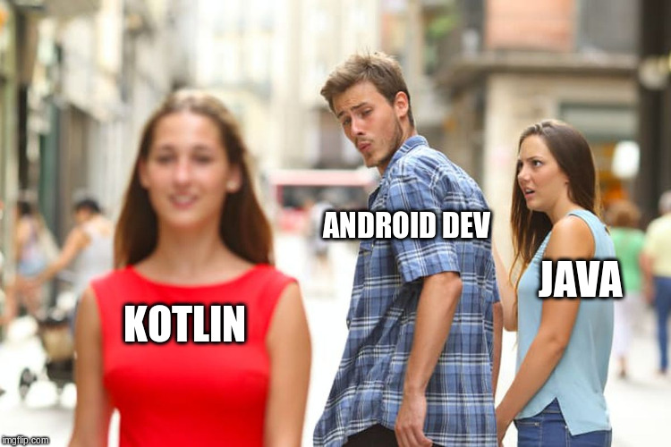

# Dev Joke
Send me a PR if you know a good Dev Joke. 
***

Two bytes meet. The first byte asks, “Are you ill?” The second byte replies, “No, just feeling a bit off.”

***

walks UDP package into bar A. 

***
I would tell you a joke about UDP, but I don't know if you will get it. 

Either way, I don't care.

***

#### Question - What will be the name of the movie on a sad developer?

`DEV`das

***

A SQL query goes into a bar, walks up to two tables and asks, "Can I join you?"

***

#### Question - How did the developer announce her engagement?

`this.engaged = true`
***

#### Question - Why is the Javascript developer sad?


Because they do not Node how to Express themselves.

***


#### Question - How do you comfort a JavaScript bug? 


You console it.

***


#### Question - Why couldn't the React component understand the joke? 


It didn't get the context. 

***


#### Question - Why did the JavaScript developer leave? 


Because she didn't get arrays

***

#### Question - Why do functions always break up? 


Because they have constant arguments.

***


#### Question - Why do programmers get confused between Halloween and Christmas?


Because OCT 31 = DEC 25 

***

#### Question - What is programmer's favourite hangout place?

Foo Bar

***


#### Question - What kind of doctors fixes broken websites?

A URLogist

###
-Knock knock
-Unsynchronized block
-Who's there?


***

#### Question - Why does no one likes SQLrillex?

He keeps dropping the database

***

#### Question - How did the html get drunk?

It had too many `<br/>`

***

### Question - You know the joke of the guy who forgot to increase the variable in his while loop?
You know the joke of the guy who forgot to increase the variable in his while loop? <br/>
You know the joke of the guy who forgot to increase the variable in his while loop? <br/>
You know the joke of the guy who forgot to increase the variable in his while loop? <br/>
You know the joke of the guy who forgot to increase the variable in his while loop? <br/>
You know the joke of the guy who forgot to increase the variable in his while loop? <br/>
You know the joke of the guy who forgot to increase the variable in his while loop? <br/>

***

#### Question: Why do C# and Java developers keep breaking their keyboards ?


Because they use a strongly typed language.

***

#### Question - Why did the developer die in the shower?

He read the shampoo bottle instructions: Lather. Rinse. Repeat.

***

#### Question - How do I solve these errors my friend?

Just close the console windows, you wont see any errors.

***

#### Question - What if your boyfriend is a programmer?

She: I told him to call me.
He: He asked me about my parameters and return type.

***

#### Question - What did the developer said to the repository?

FORK YOU!

***

#### Question: What do you call the security outside of a samsung store?

Guardians of the Galaxy
  
***
#### Question: Why don't fish like React?

Hooks!

***

#### Question: Why does Python live on land?

Because it's above C-level

***

#### Question - How are computers and air conditioners similar?

They are both useless when you open windows

***

Two bytes meet.  The first byte asks, “Are you ill?”
The second byte replies, “No, just feeling a bit off.”

***
### Question - Who is a programmer?

Answer: A person who fixed a problem that you don't know you have , in a way you don't understand.

***
### Question - Why do Java developers wear glasses?

Answer: Because they can't C# !

***

### Question - How do functions break up?

Answer: They stop calling each other.

***

### Question - 0 is false and 1 is true, right?

Answer: 1

***

#### Question: How many programmers does it take to change a light bulb?

Answer: None – It’s a hardware problem

***

He: You're semicolon to my code ;)

She: I code in Python!

***

#### Question: What is an algorithm?

ALGORITHM(noun) - Word used by programmers when they do not want to explain what they did.

***

1/3 of US bandwidth is used by Netflix.

the rest is used by `rm -rf node_modules && npm install`

***

Debugging: Like the detective in a crime movie where you are also the murderer.

***

Sharon: I'm facing error

Daniel: close the console window

Sharon: and now
        ?
        
Daniel: that's it       
        the error is gone
        
Sharon: 😐

***

Being a Programmer and watching someone HACK a computer on a TV show is like a nurse and watching someone in the movie take blood with a carrot.

***

Programmer 1: We have a problem!
Programmer 2: Let’s use RegEx!
Programmer 1: Now we have two problems.

***

She: I told him to call me

He Asked about my parameters and return type

***

Yesterday I changed the name of my Wifi to "*hack if you can*"...

Today I found it named "*challenge accepted*"

***

My girlfriend dumped me after I named a class after her. She felt I treated her like an object.

***

Have you heard about the new Cray super computer?  It’s so fast, it executes an infinite loop in 6 seconds.

***

Trying to fix the problem I created when I tried to fix the problems I created when I tried to fix the problems I created when there was a problem

***

A programmer’s wife asks: “Would you go to the shop and pick up a loaf of bread? And if they have eggs, get a dozen.”

The programmer returns home with 12 loaves of bread.

“They had eggs.”

***

“Knock, knock.”

“Who’s there?”

very... long... pause...

“Java.”

***

A journalist asks a programmer 

what makes the code bad ?

NO COMMENT

***

```

if (coding) {
  headphones = true;
  focus=100;
  conversation = null;
}

```

***


***


***


***


***


***


***


***


***


***


***


***


***


***


***


***


***


***


***


***


***


***


***


***


***


***


***


***


***


***


***


***


***


***


***


*** 


***


***



***


***


***


***


***


***


***


***


***


***
