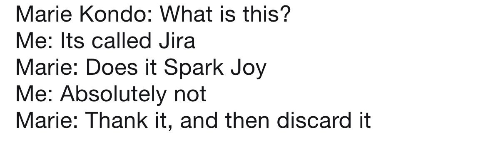

# Dev Joke
Send me a PR if you know a good Dev Joke. 

***

A SQL query goes into a bar, walks up to two tables and asks, "Can I join you?"

***

#### Question - How did the developer announce her engagement?

`this.engaged = true`
***

#### Question - Why is the Javascript developer sad?

Because they do not Node how to Express themselves.

***

#### Question - How do you comfort a JavaScript bug? 

You console it.

***

#### Question - Why couldn't the React component understand the joke? 

It didn't get the context. 

***

#### Question - Why did the JavaScript developer leave? 

Because she didn't get arrays

***

#### Question - Why do functions always break up? 

Because they have constant arguments.

***

#### Question - Why do programmers get confused between Halloween and Christmas?

Because OCT 31 = DEC 25 

***

#### Question - What is programmer's favourite hangout place?

Foo Bar

#### Question - What kind of doctors fixes broken websites?

A URLogist

***

***

***

***

***

***

***

***

***

***

***

***

***

***

***

***

***

***

***

***

***

***

***

***

***

***

***

